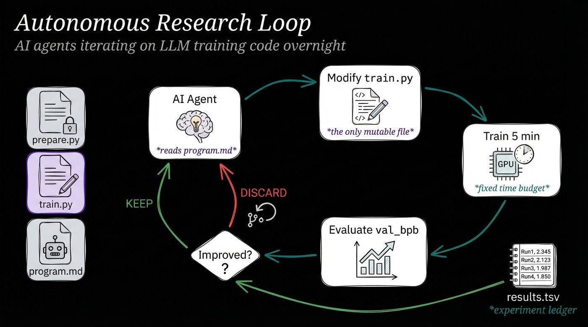
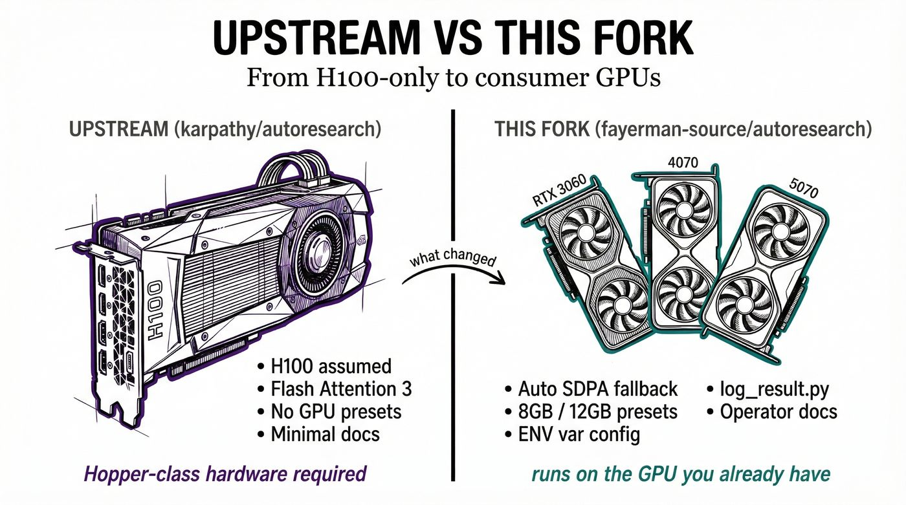

# autoresearch

Autonomous experiment loop for a small single-GPU language-model training setup.

This fork stays close to `karpathy/autoresearch` in shape, but it is easier to run on mainstream NVIDIA cards instead of assuming Hopper-class hardware.



## Why This Fork Exists

If you're trying to run `autoresearch` on a normal local NVIDIA GPU, the upstream defaults may not work cleanly as-is. This fork keeps the original small-loop idea, but smooths out the first-run path for consumer cards with a safer attention fallback, small runtime presets, and clearer operator docs.

## What This Repo Is

The loop is intentionally small:

- one mutable target: `train.py`
- one fixed evaluation harness: `prepare.py`
- one fixed run budget: 5 minutes
- one scalar outcome: `val_bpb` (lower is better)
- one ledger: `results.tsv`

The point is not to preserve this exact training recipe forever. The useful pattern is the keep/discard experiment loop under a fixed evaluation harness.

## What This Fork Changes



Compared with upstream, this fork adds a few practical changes for local research use:

- safer attention fallback on non-Hopper NVIDIA GPUs
- optional consumer-GPU presets through `AR_PRESET`
- clearer run logging and startup output
- `log_result.py` for appending completed runs to `results.tsv`
- more direct operator docs in `README.md` and `program.md`

## Requirements

- Linux
- one NVIDIA GPU
- Python 3.10+
- [`uv`](https://docs.astral.sh/uv/)

This repo is still GPU-only. It is not intended for CPU training or broad multi-platform support.

## Files That Matter

- `prepare.py`: data prep, tokenizer training, dataloaders, fixed eval utilities
- `train.py`: model, optimizer, training loop, experiment surface
- `program.md`: baseline instructions for an autonomous agent
- `log_result.py`: append a completed run summary to `results.tsv`
- `pyproject.toml`: dependencies

## Quick Start

```bash
# install dependencies
uv sync

# one-time data/tokenizer prep
uv run prepare.py

# run one safer baseline experiment for consumer GPUs
AR_PRESET=12gb uv run train.py

# append the summary from the run log to the ledger
python log_result.py --log run.log --status keep --description "baseline"
```

If those commands work, the repo is ready for manual or agent-driven iteration.

## Consumer GPU Presets

This fork supports a small preset layer so people on weaker GPUs can get to a working first run without editing source.

Available presets:

- `AR_PRESET=8gb`: smaller microbatch, smaller total batch, compile disabled
- `AR_PRESET=12gb`: safer defaults for cards like a 12 GB RTX 5070, compile disabled
- `AR_PRESET=h100`: keeps the higher-throughput defaults closer to upstream assumptions

Examples:

```bash
# safer first run on a 12 GB card
AR_PRESET=12gb uv run train.py

# even smaller run shape for tighter VRAM budgets
AR_PRESET=8gb uv run train.py

# override any preset explicitly
AR_PRESET=12gb AR_DEVICE_BATCH_SIZE=2 AR_TOTAL_BATCH_SIZE=16384 uv run train.py
```

Environment variables supported by `train.py`:

- `AR_PRESET`
- `AR_ASPECT_RATIO`
- `AR_HEAD_DIM`
- `AR_WINDOW_PATTERN`
- `AR_DEPTH`
- `AR_DEVICE_BATCH_SIZE`
- `AR_TOTAL_BATCH_SIZE`
- `AR_COMPILE`
- `AR_PEAK_FLOPS`

Precedence is simple: explicit `AR_*` values override the preset.

## Expected Behavior On Consumer GPUs

This repo still assumes a single CUDA GPU and a short fixed-time training run. On non-Hopper GPUs, the fork falls back from Flash Attention 3 to PyTorch SDPA automatically and prints that choice at startup.

A few practical notes:

- start with `AR_PRESET=12gb` on 12 GB cards
- if compilation is slow or unstable, keep `AR_COMPILE=0`
- if VRAM is tight, lower `AR_DEVICE_BATCH_SIZE` first
- this fork is meant to be easier to start, not universally portable

## Agent Loop

The reusable idea here is the loop shape:

1. keep one mutable file
2. keep the evaluation harness fixed
3. run on a fixed time budget
4. record a compact summary
5. keep or discard based on the result

`program.md` contains the baseline agent instructions for that loop.

## Project Structure

```text
prepare.py      fixed data prep and evaluation utilities
train.py        mutable experiment surface
program.md      agent instructions
log_result.py   append summaries to results.tsv
pyproject.toml  dependencies
results.tsv     experiment ledger
```

## Design Constraints

- single machine
- single NVIDIA GPU
- short runs over maximum throughput
- inspectable code over configuration sprawl
- minimal dependencies

If you need distributed training, broad hardware portability, or a larger experiment platform, this repo is the wrong base.

## Notable Forks

- [miolini/autoresearch-macos](https://github.com/miolini/autoresearch-macos)
- [trevin-creator/autoresearch-mlx](https://github.com/trevin-creator/autoresearch-mlx)

## License

MIT
